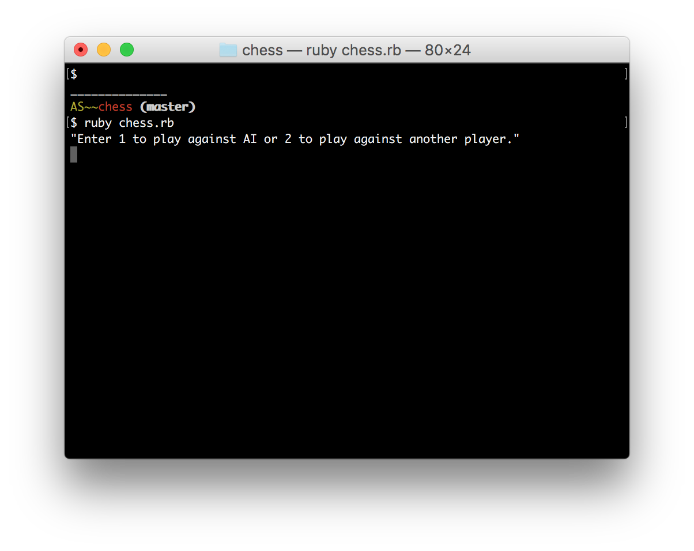
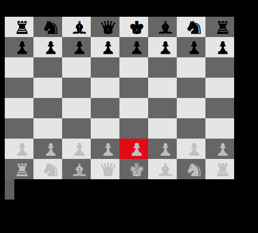

# Chess

Chess implemented in Ruby.

## How to play
Run `ruby chess.rb` in the terminal to start the game. Use the keyboard arrow keys to move cursor on the board, and the enter key to select your piece. The game uses `cursorable` for tracking keyboard input.

